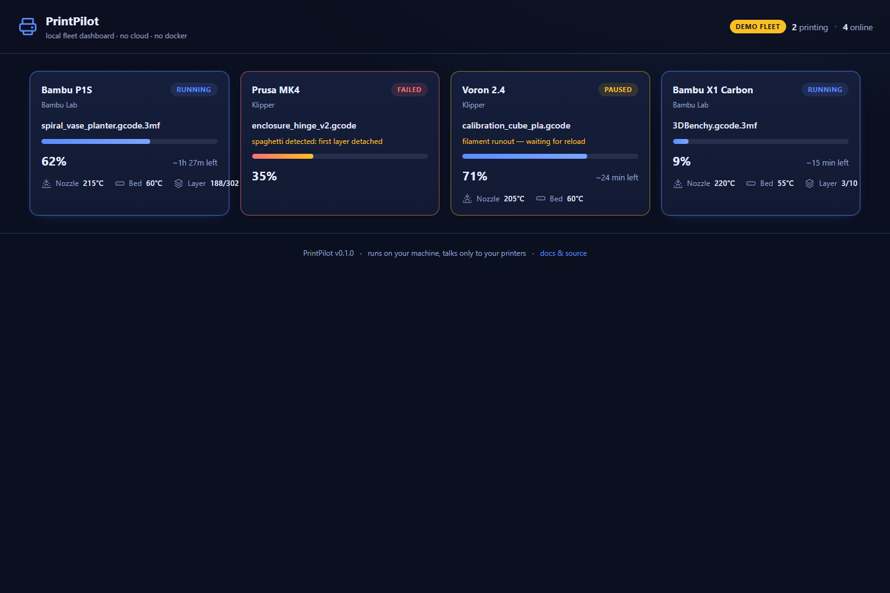

# PrintPilot

**A zero-cloud, single-binary dashboard for mixed 3D printer fleets.**
Download one file, point it at your printers, open your browser. No Docker, no Python, no vendor cloud, no account.



Bambu Lab on the left, Klipper in the middle — one page, live progress, and a Telegram ping the moment a job fails.

## Why

Two trends collided:

- **Vendor-cloud distrust.** Bambu's January 2025 "authorized slicer" firmware change and the May 2026 open-source controversy taught a whole generation of printer owners that cloud dependency is a liability. LAN-only is the new must-have.
- **Install fatigue.** The existing self-hosted dashboards are excellent — and demand Docker, Python environments, or a full Home Assistant install. The most common reply under those projects, verbatim from r/BambuLab: *"I have no idea what a Docker or Podman is and I don't even know how to install this thing."*

PrintPilot takes the hardest possible stance on install friction: **it is one executable.** Double-click it, and it serves the dashboard locally. That's the whole install.

## Supported printers

| Printer | Protocol | Notes |
|---|---|---|
| Bambu Lab X1 / P1 / A1 series | LAN MQTT (port 8883) | Developer Mode / LAN Only must be enabled — [official guide](https://wiki.bambulab.com/en/knowledge-sharing/enable-developer-mode) |
| Klipper with Moonraker | HTTP polling (port 7125) | Voron, RatRig, Elegoo Neptune, Sovol, any Klipper printer |
| Prusa (PrusaLink) | planned v1.1 | see [roadmap](#roadmap) |

Everything stays on your LAN. The only network traffic PrintPilot makes is to the printers you configured (and, if you enable it, to the Telegram Bot API for your alerts).

## Quick start

```bash
# 1. Try the demo — no printer needed
./printpilot --mock
# open http://127.0.0.1:8787

# 2. Real printers: create config.json next to the binary (see below)
./printpilot
```

Or from source:

```bash
go build -o printpilot . && ./printpilot --mock
```

## Configuration

`config.json` next to the binary (see [`config.example.json`](config.example.json)):

```json
{
  "port": 8787,
  "printers": [
    {
      "id": "x1c",
      "type": "bambu",
      "name": "Bambu X1 Carbon",
      "host": "192.168.1.42",
      "serial": "00M09A930012345",
      "access_code": "12345678",
      "webcam_url": "http://192.168.1.42:8080/?action=stream"
    },
    {
      "id": "voron",
      "type": "moonraker",
      "name": "Voron 2.4",
      "host": "192.168.1.51",
      "webcam_url": "http://192.168.1.51/webcam/?action=stream"
    }
  ],
  "alerts": {
    "telegram": { "bot_token": "123:ABC", "chat_id": "-100123456" },
    "webhook":  { "url": "https://your-endpoint.example/printpilot" },
    "events":   ["failed", "finished"]
  }
}
```

**Finding your Bambu serial & access code:** the serial is on the printer screen under *Settings → Device*, the LAN access code under *Settings → Network*. Enable *Developer Mode* / *LAN Only Mode* there as well (per-firmware instructions in the [Bambu wiki](https://wiki.bambulab.com/en/knowledge-sharing/enable-developer-mode)).

**Alerts** fire on `failed`, `finished` and `offline` transitions — once per job (persisted dedup, so restarting PrintPilot never re-spams). Telegram needs a bot token from [@BotFather](https://t.me/BotFather); the webhook receives a JSON payload with `X-PrintPilot-Event` header.

## Security model

Bambu printers present self-signed TLS certificates. PrintPilot does **not** disable certificate verification (a common shortcut in this space). Instead it uses **trust-on-first-use pinning**: the first certificate a printer presents is pinned (SHA-256) in `printer-pins.json`; any later change aborts the connection with a loud error instead of silently continuing. If you replace a printer's mainboard on purpose, delete its pin.

State that matters (`printer-pins.json`, alert dedup) is written next to the binary with `0600` permissions. The dashboard binds to all interfaces on your LAN — put it behind a firewall or use `--config` with a reverse proxy if you expose it further.

## How it compares

| | PrintPilot | BamBuddy | Print Farm Manager | SimplyPrint | Obico | Home Assistant |
|---|---|---|---|---|---|---|
| Install | **one binary** | Docker/Python | Docker/Node | cloud SaaS | Docker + ML service | full HA |
| Mixed brands (Bambu + Klipper + …) | ✅ | ❌ Bambu only | ✅ | ✅ | ✅ | via integrations |
| Cloud/account required | ❌ | ❌ | ❌ | ✅ | optional | ❌ |
| Finish/fail/offline alerts | ✅ built-in | ✅ | ❌ | paid tiers | paid (AI) | DIY automation |
| Cost | free, MIT | free | free | €39.99/mo farm tier | freemium | free |

## Building & releasing

```bash
go test ./...         # unit tests for parsing, config, alerts, web
go vet ./...
goreleaser release --snapshot --clean   # local cross-compile check
```

CI (GitHub Actions) runs fmt-check, vet and tests on every push/PR; tagged releases (`v*`) publish cross-compiled binaries via GoReleaser and a Docker image.

## Architecture

```
printpilot
├── internal/bambu      Bambu LAN MQTT connector + TLS pin store
├── internal/moonraker  Moonraker HTTP polling connector
├── internal/mock       --mock demo fleet (same data model as real connectors)
├── internal/printer    normalized status model
├── internal/store      thread-safe in-memory status registry
├── internal/alerts     Telegram + webhook notifiers, persisted dedup
├── internal/web        embedded dashboard (html/template + vanilla JS, zero CDN)
└── main.go             wiring, flags, graceful shutdown
```

One connector, one goroutine, one normalized `printer.Status` struct — the dashboard and the alert manager only ever see that struct. Adding a brand means adding one package.

## Roadmap

- [ ] v1.1 — PrusaLink connector, per-printer alert overrides
- [ ] v1.2 — job history + farm statistics (print hours per printer)
- [ ] v1.3 — optional AI failure detection via local snapshot diffing (no cloud)

## License

[MIT](LICENSE)
